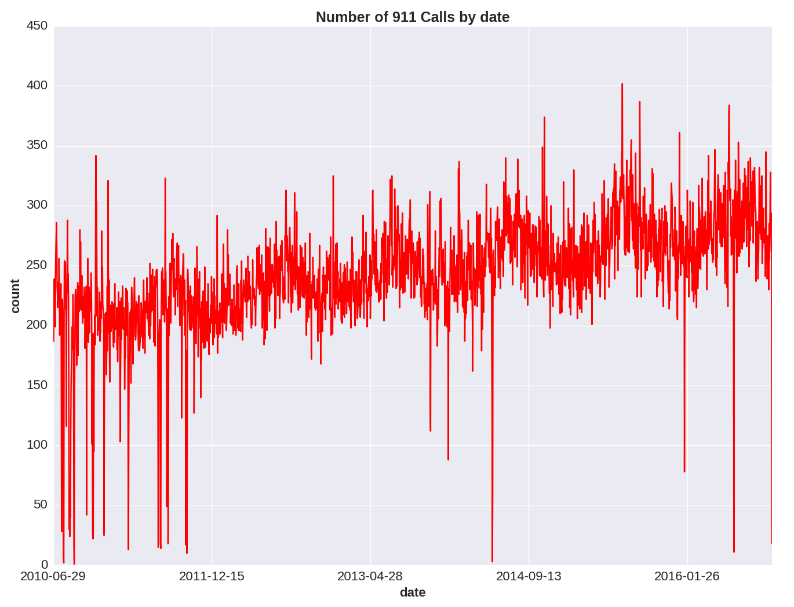

# Predicting Seattle Medical 911 Call Activity and Optimizing Allocation of Resources

#### Figure 1: Seattle medical 911 calls by neighborhood.
 

#### Figure 2: Zones assigned for modeling purposes.
 

#### Figure 3: Count of Seattle 911 calls by day and zone.
 

#### Figure 4: Count of Seattle 911 calls by day city-wide.
 

##### The goal of this project is to reduce response time to medical emergencies to save lives and improve medical outcomes. Poisson regression was used to predict medical 911 call frequencies. A custom cost function used these predicted frequencies to select optimal placement of emergency response resources for rapid response.
