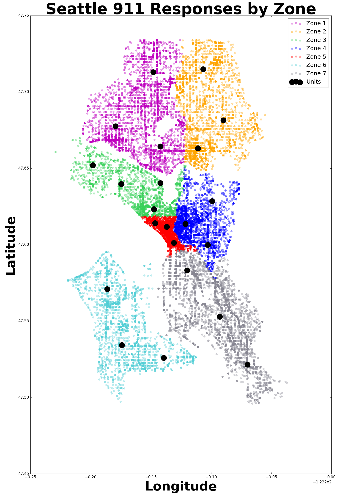

# Predicting Seattle Medical 911 Response Activity and Optimizing Allocation of Resources

##### The goal of this project is to reduce response time to medical emergencies to save lives and improve medical outcomes. Poisson regression was used to predict medical 911 response frequencies. A custom cost function used these predicted frequencies to select optimal placement of emergency response resources for rapid response.
 
<a href="url">Rapid-Rescue.com</a>
 

#### Figure 1: Count of Seattle 911 responses by day city-wide and Poisson regression model predictions.
 
The machine learning algorithm Poisson regression is used to predict the number of expected medical emergency responses in each zone of the city during a given period. Poisson regression is a generalized linear model used to predict counts or frequencies. The model considers historical trends as well as important events such as major holidays and sporting events. Note that the model is able to track with the increasing number of medical emergencies as well as seasonal trends. Once number of medical emergencies has been predicted, an allocation algorithm allocates the emergency response units to each zone based on anticipated need.
  

#### Figure 2: Zones assigned for modeling purposes.
 
Once predictions have been made and units have been allocated to zones, relevant historical data is retrieved. A geographical variation of K-means clustering is used in conjunction with the allocations and historical data to determine the optimal emergency response unit placements for rapid response. The web app uses a lite version of the model which limits the clustering operation to 500 historical data points per zone. This allows the model to return results within seconds rather than minutes, at the cost of slightly decreased precision. A full version of the model with Jupyter interface intended for advanced users can be found here.
  

#### Figure 3: User Input is handed to the Poisson Model and History Retriever. The Allocator uses predictions from the Poisson Model to allocate units to each zone. The Clusterer determines optimal unit locations based upon information from the Allocator and the relevant historical data from the History Retriever.
 
The data entered by the user is handed to the Poisson Model and History Retriever. The Poisson Model predicts the number of expected emergency medical responses for each zone and then passes that information to the Allocator. The Allocator distributes the units to each zone based on expected need and hands these allocations to the Clusterer. The information entered by the user is also given to the History Retriever, which retrieves relevant background information and passes it to the Clusterer. The Clusterer uses the allocations as well as the relevant historical data to calculate the optimal placements of emergency resources for rapid responses.
  
Data cleaning, manipulation, exploration and modeling perfomed with Python, SciKit Learn, StatsModels, and R. Text editors and environments include Atom, Jupyter Notebook, and R-Studio. Visuals creates with Matplotlib and draw.io. Web App generated with Flask and jQuery.
 

