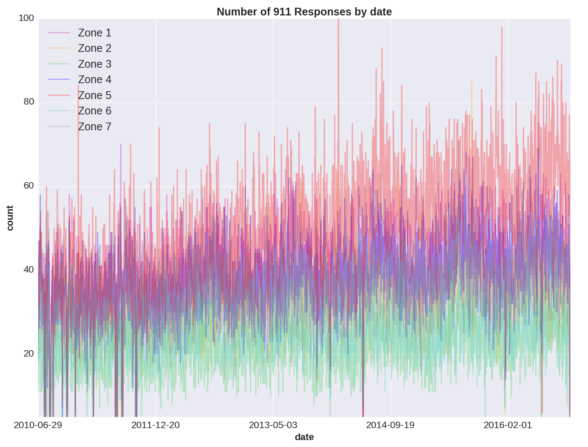
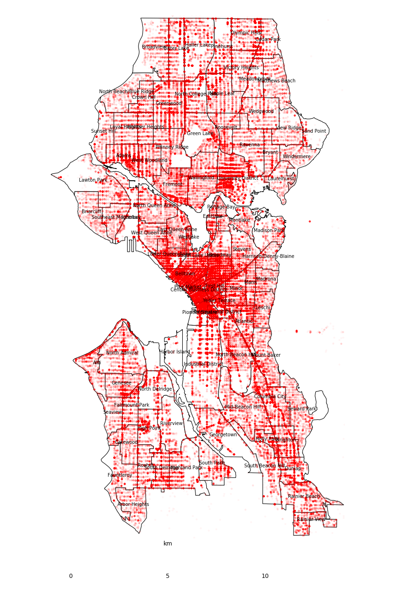

# Predicting Seattle Medical 911 Response Activity and Optimizing Allocation of Resources

#### Figure 1: Count of Seattle 911 responses by day city-wide and Poisson regression model predictions.
 

#### Figure 2: Zones assigned for modeling purposes.
 

#### Figure 3: User Input is handed to the Poisson Model and History Retriever. The Allocator uses predictions from the Poisson Model to allocate units to each zone. The Clusterer determines optimal unit locations based upon information from the Allocator and the relevant historical data from the History Retriever. 
 

#### Figure 4: Count of Seattle 911 responses by day and zone.
 

#### Figure 5: Seattle medical 911 responses by neighborhood.
 

##### The goal of this project is to reduce response time to medical emergencies to save lives and improve medical outcomes. Poisson regression was used to predict medical 911 response frequencies. A custom cost function used these predicted frequencies to select optimal placement of emergency response resources for rapid response.

 

